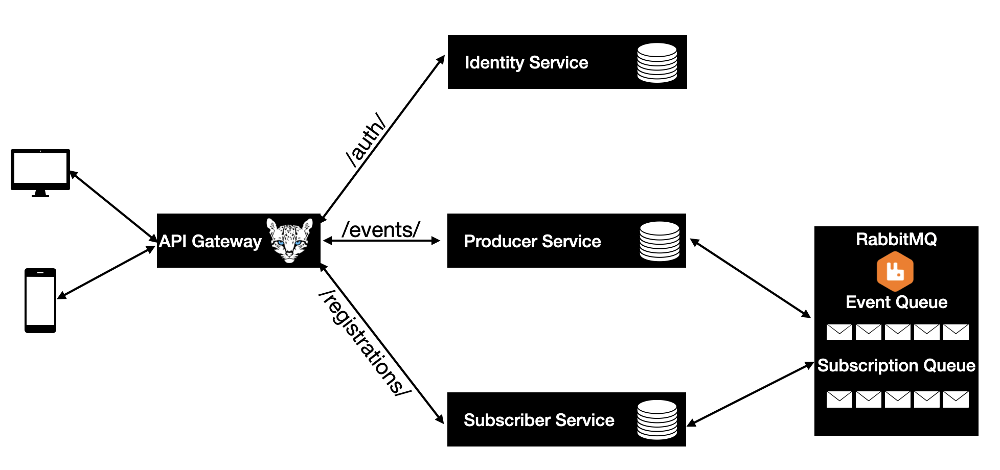

# EventPoc - Microservices-Based Event Management System
Where:
- **Producers** can **create events**.
- **Subscribers** can **register for events**.
- The system is built for **scalability, flexibility, and maintainability**.


## **📝 Overview**
EventPoc is a **microservices-based** event management system built with:
- **ASP.NET Core**
- **RabbitMQ** (Message Queue)
- **Ocelot API Gateway**
- **SQLite** (Database)

✅ **Key Features:**
- **🔐 Authentication & Authorization** → JWT-based authentication (`IdentityService`)
- **📅 Event Management** → Producers create events (`ProducerService`)
- **📝 Event Registration** → Subscribers register for events (`SubscriptionService`)
- **📢 Event-Driven Architecture** → RabbitMQ ensures real-time event updates
- **🌐 API Gateway** → Ocelot routes requests to the correct microservice
- **📚 DDD & Hexagonal Architecture** → Keeps business logic clean & scalable

## **📌 System Architecture**
The system follows a **Microservices Architecture**, with each service handling a specific function and communicating via **RabbitMQ**.



## **📚 Domain-Driven Design (DDD)**
EventPoc follows **DDD principles**:
- **Entities** (Event, Registration, User)
- **Use Cases** (Application Layer)
- **Infrastructure** (Database, Messaging, Authentication)
- **Separation of Concerns** between **Domain, Application, Infrastructure, and Presentation layers**

### **🛠️ Hexagonal Architecture (Ports & Adapters)**
- The system follows **Hexagonal Architecture** (also known as **Ports & Adapters**).
- Business logic (**Domain Layer**) is **isolated from external dependencies**.
- External components (**Databases, RabbitMQ, API Gateway**) interact **only through Ports & Adapters**.
- ✅ **This ensures testability, flexibility, and maintainability.**

## **📌 Architectural Pattern**


---

## **🚀 Getting Started**
### **1️⃣ Prerequisites**
- **Docker** & **Docker Compose**
- **.NET 9 SDK**
- **Postman (Optional, or use `curl`)**

### 2️⃣ Modify `.env` File if required
- `cp .env.example .env`
- Generate a new JWT secret: https://jwtsecret.com/generate
- Adjust `JWT_SECRET` environmental variable

### 3️⃣ Run the Application

```docker-compose up -d --build```

The following services will be available after startup:

    API Gateway → http://localhost:5000
    IdentityService → http://localhost:5001
    ProducerService → http://localhost:5002
    SubscriptionService → http://localhost:5003
    RabbitMQ Management → http://localhost:15672 (guest/guest)

## 📖 API Documentation

➡️ [Postman Collection](postman_collection.json)

Each service provides an **OpenAPI specification** in JSON format:

| **Service** | **OpenAPI Spec URL** |
|------------|---------------------------|
| **IdentityService** | [🔗 OpenAPI JSON](http://localhost:5001/openapi/v1.json) |
| **ProducerService** | [🔗 OpenAPI JSON](http://localhost:5002/openapi/v1.json) |
| **SubscriptionService** | [🔗 OpenAPI JSON](http://localhost:5003/openapi/v1.json) |

- Use an **OpenAPI viewer** like [Swagger Editor](https://editor.swagger.io/) or [Redocly Viewer](https://redocly.github.io/redoc/) to load the JSON files.

## 🛠️ ADR (Architecture Decision Records)

All major architecture decisions are documented in the [ADR Directory](ADRs) 📁

## **📌 Image Credits**
- *Hexagonal Architecture image adapted from:*  
  [Hexagonal Architecture Introduction & Structure – Wata.es](https://wata.es/hexagonal-architecture-introduction-and-structure/)
